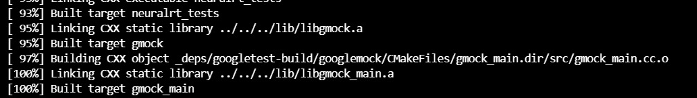
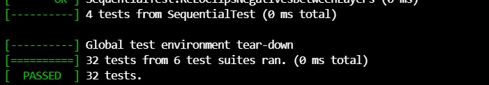
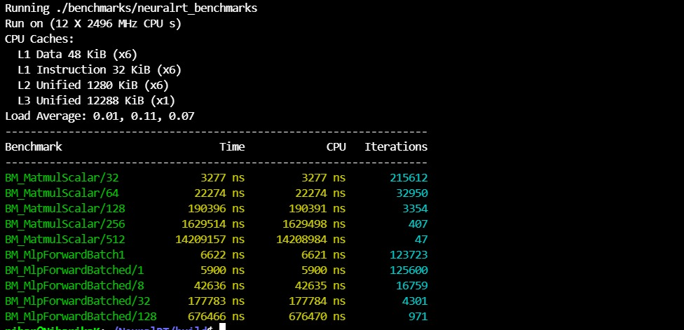
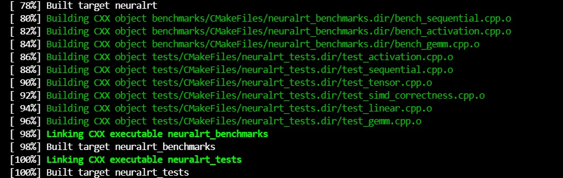
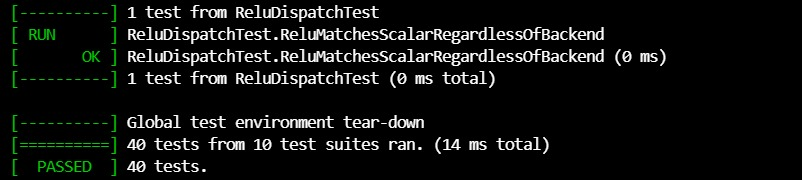
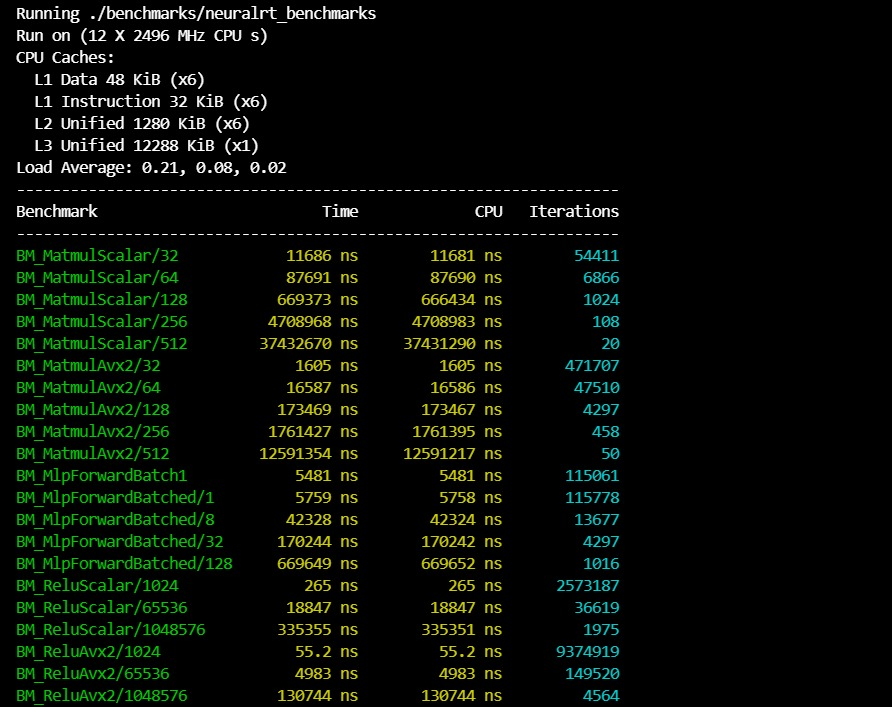
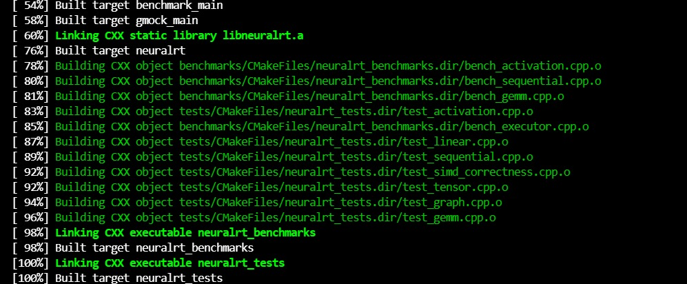
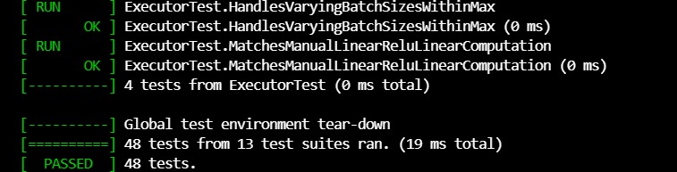
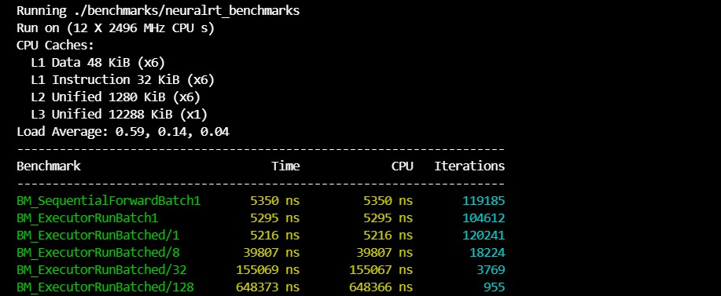

# NeuralRT

A CPU-only neural network inference runtime built from scratch in modern C++17 featuring custom tensor abstractions, dense linear algebra kernels, AVX2 SIMD acceleration, and a static graph executor with deterministic memory behavior.

Unlike educational "ML from scratch" projects that focus purely on correctness, NeuralRT was built as a systems engineering project focused on runtime performance, memory management, cache efficiency, and inference execution.

The project progressively evolves through three phases:

* Phase 1 — Core Runtime
* Phase 2 — SIMD Optimization
* Phase 3 — Static Graph Executor

Each phase includes automated testing, benchmarking, and implementation validation.

---

# Motivation

Modern machine learning frameworks hide substantial systems complexity behind high-level APIs.

NeuralRT was built to explore the underlying infrastructure required to execute neural networks efficiently on CPU hardware:

* Tensor representations
* Memory layouts
* Matrix multiplication kernels
* SIMD vectorization
* Graph execution
* Buffer reuse
* Allocation-free inference

The goal is not training, autograd, or large-model support.

The goal is understanding how inference runtimes actually work.

---

# Tech Stack

* C++17
* CMake
* AVX2 / FMA Intrinsics
* GoogleTest
* Google Benchmark

---

# Architecture

```text
include/neuralrt/
├── core/
│   ├── shape.h
│   └── tensor.h
│
├── ops/
│   ├── gemm.h
│   ├── linear.h
│   └── activation.h
│
├── model/
│   └── sequential.h
│
└── graph/
    ├── graph.h
    ├── planner.h
    └── executor.h
```

Source files mirror the same structure under `src/`.

---

# Core Components

## Tensor System

Features:

* Dynamic N-dimensional tensors
* Row-major contiguous layout
* Runtime shape validation
* Shared-buffer reshape
* Zero-copy tensor views
* Explicit ownership semantics

The tensor abstraction forms the foundation for all operators and graph execution.

---

## Operators

### GEMM

Matrix multiplication implementations:

* Scalar reference kernel
* AVX2 + FMA optimized kernel
* Cache-blocked execution
* Explicit output-buffer APIs

Both implementations are maintained permanently and validated against each other.

---

### Activations

Implemented:

* ReLU (Scalar)
* ReLU (AVX2)

The SIMD implementation is continuously cross-validated against the scalar implementation.

---

## Sequential Model

A lightweight model abstraction supporting:

* Dense layers
* ReLU layers
* Ordered execution

Example:

```cpp
Sequential model;

model.add(std::make_unique<Linear>(128,256));
model.add(std::make_unique<ReLU>());
model.add(std::make_unique<Linear>(256,64));
model.add(std::make_unique<ReLU>());
model.add(std::make_unique<Linear>(64,10));
```

---

## Static Graph Runtime

Phase 3 introduces a lightweight inference runtime.

### Graph

Represents:

* Inputs
* Linear nodes
* ReLU nodes
* Tensor dependencies

### Planner

Responsible for:

* Topological sorting
* Lifetime analysis
* Buffer slot assignment
* Memory reuse planning

### Executor

Responsible for:

* Preallocated memory
* Buffer reuse
* Batch-aware execution
* Zero heap allocations during inference

All intermediate storage is allocated once during initialization.

Inference execution performs no dynamic memory allocation.

---

# Development Phases

## Phase 1 — Core Runtime

Implemented:

* Shape abstraction
* Tensor abstraction
* Scalar GEMM
* Linear layer
* ReLU
* Sequential execution

Validation:

* Tensor correctness
* Operator correctness
* Model correctness

Result:

**32 / 32 tests passing**

---

## Phase 2 — SIMD Optimization

Implemented:

* AVX2 GEMM
* FMA acceleration
* SIMD dispatch
* AVX2 ReLU

Validation:

* SIMD vs Scalar comparison
* Non-multiple-of-8 dimensions
* Boundary-condition testing

Result:

**40 / 40 tests passing**

---

## Phase 3 — Static Graph Executor

Implemented:

* Graph IR
* Planner
* Buffer reuse
* Executor runtime
* Batch-aware inference

Validation:

* Graph correctness
* Executor correctness
* Memory reuse correctness
* End-to-end inference

Result:

**48 / 48 tests passing**

---

# Benchmark Results

Benchmarks were executed using Google Benchmark in Release mode (`-O3`).

Performance measurements are included directly from benchmark runs captured during development.

The repository intentionally preserves benchmark evidence for every development phase.

---

## Executor Performance

### Sequential vs Executor

| Path                    | Time    |
| ----------------------- | ------- |
| SequentialForwardBatch1 | 5350 ns |
| ExecutorRunBatch1       | 5295 ns |

The executor is designed primarily for deterministic memory behavior rather than raw throughput improvements.

---

## Executor Batch Scaling

| Batch Size | Time      |
| ---------- | --------- |
| 1          | 5295 ns   |
| 8          | 39807 ns  |
| 32         | 155069 ns |
| 128        | 648373 ns |

Execution scales approximately linearly with batch size, consistent with GEMM-dominated workloads.

---

# Validation Summary

| Phase   | Tests Passing |
| ------- | ------------- |
| Phase 1 | 32 / 32       |
| Phase 2 | 40 / 40       |
| Phase 3 | 48 / 48       |

---

# Proof of Work

## Phase 1 — Core Runtime

### Build



### Tests



### Benchmarks



---

## Phase 2 — SIMD Optimization

### Build



### Tests



### Benchmarks



---

## Phase 3 — Static Graph Executor

### Build



### Tests



### Benchmarks



---

# Build Instructions

Requirements:

* CMake 3.16+
* C++17 Compiler
* x86-64 CPU

Optional:

* AVX2 + FMA Support

Build:

```bash
mkdir build
cd build

cmake .. -DCMAKE_BUILD_TYPE=Release

cmake --build . -j$(nproc)
```

Run Tests:

```bash
./tests/neuralrt_tests
```

Run Benchmarks:

```bash
./benchmarks/neuralrt_benchmarks
```

Disable SIMD:

```bash
cmake .. \
  -DCMAKE_BUILD_TYPE=Release \
  -DNEURALRT_ENABLE_AVX2=OFF
```

---

# Engineering Notes

## Separate Translation Units

Scalar and AVX2 kernels are compiled separately.

This prevents compiler auto-vectorization from contaminating the scalar baseline and ensures benchmark comparisons remain meaningful.

---

## Register Accumulation

The AVX2 GEMM kernel accumulates partial sums entirely in registers before writing results back to memory.

This minimizes memory traffic and improves arithmetic intensity.

---

## Tensor Views

`Tensor::view()` exists separately from `reshape()`.

The executor frequently exposes smaller logical tensors backed by larger preallocated buffers, making explicit views necessary.

---

# Future Work

## Phase 4

* ONNX model loading
* ONNX graph import
* PyTorch numerical parity validation

## Phase 5

* PyTorch CPU comparison
* Latency analysis
* Throughput analysis
* Memory footprint comparison
* Additional operator support

The graph runtime was designed so future ONNX parsers can target the existing graph representation without requiring modifications to the planner or executor.
